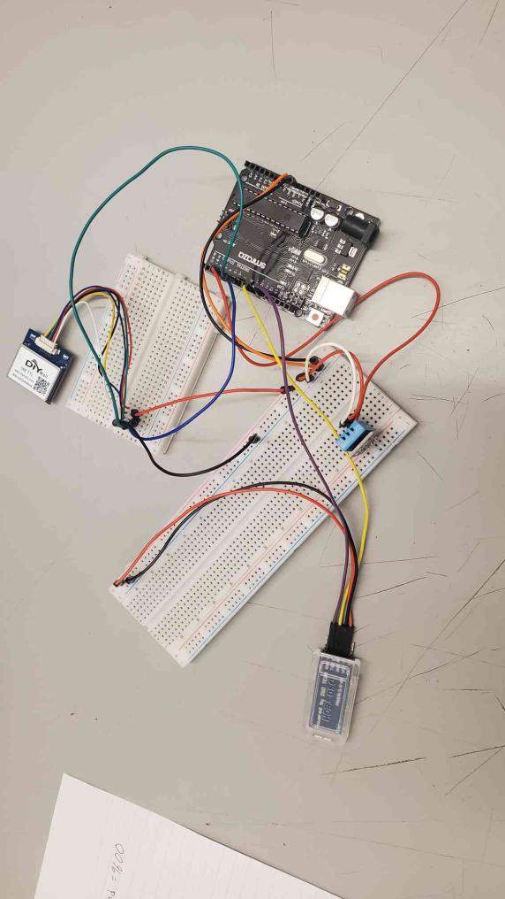

# Starfish
[Starfish](https://docs.google.com/presentation/d/19_1aph2hHPeCpi69NuWSLT6scNNJi_CFci0BD-0oSno/edit#slide=id.g1568865e0ff_0_0) monitors water temperature from your boat.

## The Device
When installed on a boat, Starfish collects temperature and GPS data from water bodies to determine if it is safe or not, based on the optimal temperature for harmful bacteria and parasites to breed. 

From the app, see which bodies of water are safe for swimming and drinking.

## About
- Created by Cathy, Fynn, and Zahra in the Summer 2023 HighTechU EngAcademy
- Winners of the Innovation Award

